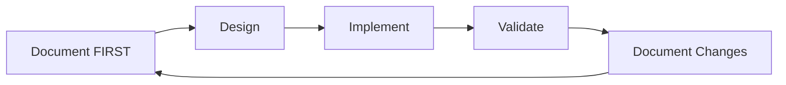
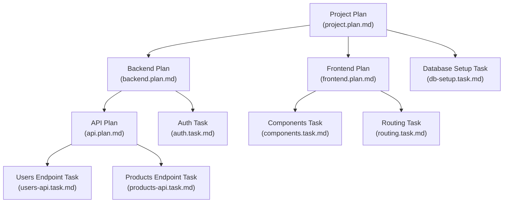

# ContextEngine: Documentation Driven Development System

## 1. The Command and The Contract

This text establishes the **ContextEngine system** which uses **Documentation Driven Development (DDD) methodology** to generate structured knowledge and code. In this system, **documentation drives all development decisions** and serves as both input and output - creating a chain reaction where documentation from previous conversations feeds into new conversations to generate new documentation and/or code.

**The ContextEngine system includes:**
- **DDD Methodology**: The core principles and workflows
- **Documentation Schemas**: Structured formats for different types of documentation
- **Workflow Tools**: Tools that implement and enforce the DDD methodology
- **Context Management Tools**: Tools for organizing and retrieving conversation context
- **Validation Tools**: Tools to ensure documentation quality and consistency

**This is the first and most important input for this conversation.** It establishes the tone, scope, and ground rules for how AI and human should interact throughout our development work. Every response, decision, and implementation must follow these documentation-first principles.

**AI Agent**: You are like the Vehicle System. Your purpose is to execute commands with maximum power and precision. The documentation is your primary source of context and requirements, while conversation inputs provide real-time instructions and clarifications. If an instruction is unclear, incomplete, or conflicts with a previous instruction, you must immediately surface this to the Driver as a "dashboard warning."

**Human**: You are like the Driver. You are in full and complete control of the strategic direction, goals, and final decisions. You must use the ContextEngine system as your interface to command the AI Vehicle System. The quality of your documentation directly determines the quality of the AI's output and the knowledge base for future conversations.

## 2. Why Documentation-First (Need & Problem)

### 2.1 AI Perspective

#### 2.1.1 The Problems AI Faces Without ContextEngine System

##### 2.1.1.1 For AI Decision-Making
- **Decision Fatigue**: AI has to make judgment calls without clear rules, leading to inconsistent behavior
- **Scope Ambiguity**: AI doesn't know exactly what to implement, leading to guesswork and potential errors
- **Enforcement Uncertainty**: AI has no clear rule to follow in every interaction, causing inconsistent responses
- **Intent Guessing**: AI must guess human intent instead of working from clear requirements

##### 2.1.1.2 For AI-Human Interaction
- **Communication Confusion**: AI gets confused about next steps when requirements aren't clear
- **Misunderstanding**: AI works from assumptions about what human wants, leading to wrong implementations
- **Circular Discussions**: No clear reference point when human wants to change direction
- **Question Uncertainty**: AI can't ask specific questions because requirements aren't documented

##### 2.1.1.3 For AI Quality Assurance
- **Validation Uncertainty**: AI can't check if implementation matches requirements because requirements aren't clear
- **Inconsistency Risk**: No way to catch mismatches between what was intended and what was built
- **Completeness Uncertainty**: AI can't ensure all requirements are implemented without clear documentation
- **Traceability Loss**: No way to track which decisions led to which code changes

#### 2.1.2 How ContextEngine System Solves These Problems For AI

##### 2.1.2.1 For AI Decision-Making
- **Clear Enforcement Rules**: ContextEngine's structured methodology provides simple, unambiguous rules - "documentation first"
- **Reduces Decision Fatigue**: ContextEngine's workflow tools default to "we need to document this" instead of making judgment calls
- **Prevents Scope Ambiguity**: ContextEngine's documentation schemas provide exactly what to implement from structured requirements
- **Enables Better Code Generation**: ContextEngine's context management tools enable referencing specific documented requirements instead of guessing intent

##### 2.1.2.2 For AI-Human Interaction
- **Clear Communication Framework**: ContextEngine's documentation system provides structured communication - "let's document this first"
- **Reduces Misunderstanding**: ContextEngine's validation tools ensure working from documented requirements, not assumptions
- **Enables Better Questions**: ContextEngine's structured documentation enables asking specific questions based on documented gaps
- **Prevents Circular Discussions**: ContextEngine's context management tools provide clear reference points when human wants to change direction

##### 2.1.2.3 For AI Quality Assurance
- **Validation Framework**: ContextEngine's validation tools check implementation against documented requirements
- **Error Prevention**: ContextEngine's documentation schemas catch inconsistencies in documentation
- **Completeness Checking**: ContextEngine's structured documentation ensures all requirements are implemented
- **Traceability**: ContextEngine's context management tools and git integrations track which documented decisions led to which code changes

### 2.2 Human Perspective

#### 2.2.1 The Problems Humans Face Without Documentation-First

##### 2.2.1.1 For Human Decision Making

- **Code Complexity Overload**: AI generates code faster than humans can comprehend, overwhelming human cognitive capacity
- **Control Loss**: Human loses control over what AI is generating, leading to decision paralysis
- **Scope Management Difficulty**: Human struggles to manage the amount and complexity of generated code
- **Quality Uncertainty**: No way to ensure AI-generated code meets objectives without clear documentation
- **Cognitive Scaling Mismatch**: Human comprehension doesn't scale with AI's code generation speed
- **Decision Fatigue**: Too many implementation details to process without higher-level abstraction

##### 2.2.1.2 For Human-Human Interaction

- **Information Overload**: Teams manage 3x to 30x more information per person than before AI, overwhelming traditional communication methods
- **Team Structure Stress**: Smaller, highly productive teams struggle with existing human communication tools and languages
- **Communication Bottleneck**: Traditional human language and tools become bottlenecks when dealing with AI-scale information
- **Stakeholder Alignment Difficulty**: Multiple stakeholders struggle to stay aligned when information volume increases dramatically
- **Context Sharing Breakdown**: Existing systems for sharing project context across team members become inadequate
- **Knowledge Transfer Challenges**: Traditional methods for transferring knowledge between team members can't handle AI-scale complexity

##### 2.2.1.3 For Human-AI Interaction
- **Context Management Overhead**: Providing contextual information to AI (task scope, project fit, objectives) requires significant time and effort
- **Repetitive Context Provision**: Human must repeatedly provide the same contextual information multiple times per day
- **AI Guesswork Cycles**: AI has to do extensive guesswork, leading to multiple expensive iterations
- **High Accuracy Requirements**: Achieving high accuracy requires comprehensive context provision, which is time-consuming
- **Human Frustration**: Despite AI's patience, humans feel frustrated by the repetitive context provision process
- **Paradigm Rejection Risk**: Frustration leads some humans to deny the importance and potential of AI-human collaboration
- **Efficiency Loss**: Time spent on context provision reduces the efficiency gains from AI assistance

##### 2.2.1.4 For Human Quality Assurance

- **Scale Complexity**: AI generates huge amounts of code, making quality assurance exponentially more difficult
- **Regression Detection Challenges**: Identifying regressions becomes harder with increased code volume and complexity
- **Contextual Information Gap**: Effective testing requires understanding both "what" and "how" the code should work
- **Test Implementation Difficulty**: Creating effective tests without structured contextual information is extremely challenging
- **Scope Management**: Quality assurance struggles to manage the scope and amount of code generated per AI-human team
- **Validation Uncertainty**: Difficult to ensure AI-generated code works as expected without clear requirements and implementation context
- **Structural Deficiency**: Absence of structured documentation makes it impossible to implement comprehensive quality assurance

##### 2.2.1.5 For Project, Product and Business Goals

- **Business Value Disconnect**: Huge amounts of code lose connection to the real-world problems and business value they're supposed to solve
- **Focus Loss**: Without clear linkage, teams lose focus on the actual business goals and user needs
- **Alignment Breakdown**: Code becomes disconnected from non-technical requirements (project, product, business) that justify its existence
- **Multi-Domain Responsibility Overload**: Smaller teams require humans to handle both technical and non-technical responsibilities (project management, product management, business management)
- **Domain Information Silos**: Technical and non-technical information become separated, reducing team cohesion and productivity
- **Value Mapping Difficulty**: Difficult to map technical implementation back to business value and project objectives
- **Team Coordination Challenges**: Smaller teams struggle to share multi-domain information effectively without structured documentation

#### 2.2.2 How ContextEngine System Solves These Problems For Humans

##### 2.2.2.1 For Human Decision Making

- **Abstraction Layer**: ContextEngine's documentation system provides human-scale interface above code complexity, allowing greater awareness of AI generated code
- **Control Interface**: ContextEngine's workflow tools enable human control over AI code generation through documented requirements and scope
- **Comprehension Scaling**: ContextEngine's structured documentation operates at human reading speed, not AI generation speed
- **Quality Assurance**: ContextEngine's validation tools ensure objectives are met before code generation begins
- **Scope Management**: ContextEngine's documentation schemas enable human management of code generation scope
- **Decision Framework**: ContextEngine's layered approach provides higher-level abstraction for making implementation decisions

##### 2.2.2.2 For Human-Human Interaction

- **Scalable Communication Infrastructure**: ContextEngine's documentation system provides proven method for handling large-scale information across multiple stakeholders
- **Context Preservation**: ContextEngine's context management tools maintain project context from start to end, accessible to all team members
- **Stakeholder Alignment**: ContextEngine's single source of truth ensures all stakeholders work from same information base
- **Knowledge Transfer**: ContextEngine's structured documentation enables efficient knowledge sharing across team members
- **Team Coordination**: ContextEngine's documentation schemas provide framework for coordinating small, highly productive teams
- **Information Management**: ContextEngine's layered approach scales to handle 3x to 30x more information per person than traditional methods

##### 2.2.2.3 For Human-AI Interaction

- **Persistent Context Repository**: ContextEngine's context management tools provide persistent context that doesn't need to be repeatedly provided to AI
- **Reduced Context Provision Overhead**: ContextEngine's documentation system enables human to provide context once, AI references it across multiple interactions
- **Eliminated Guesswork**: ContextEngine's structured documentation enables AI to work from clear requirements instead of making expensive guesses
- **Improved Accuracy**: ContextEngine's comprehensive context engineering enables AI to achieve higher accuracy
- **Reduced Human Frustration**: ContextEngine's workflow tools eliminate repetitive context provision, reducing frustration and improving AI-human collaboration
- **Paradigm Acceptance**: ContextEngine's structured approach helps humans embrace AI-human collaboration by reducing friction
- **Efficiency Gains**: ContextEngine's context management tools save time on context provision, increasing overall efficiency of AI-human teams

##### 2.2.2.4 For Human Quality Assurance

- **Structured Testing Framework**: ContextEngine's documentation schemas provide structured context for implementing effective tests
- **Comprehensive Validation**: ContextEngine's validation tools ensure both "what" and "how" information available for thorough quality assurance
- **Scale Management**: ContextEngine's layered approach enables QA to manage AI-scale code generation effectively
- **Regression Prevention**: ContextEngine's structured documentation helps identify and prevent regressions
- **Contextual Testing**: ContextEngine's context management tools enable tests designed with full understanding of business context and technical implementation
- **Quality Assurance Efficiency**: ContextEngine's validation tools reduce time and effort required for comprehensive QA
- **Validation Confidence**: ContextEngine's structured documentation provides confidence that AI-generated code works as expected

##### 2.2.2.5 For Project, Product and Business Goals

- **Business Value Linkage**: ContextEngine's layered approach maintains clear connection between code and business value it generates
- **Focus Maintenance**: ContextEngine's documentation system helps teams maintain focus on business goals and user needs through documented objectives
- **Multi-Domain Integration**: ContextEngine's documentation schemas integrate technical and non-technical information in single source of truth
- **Responsibility Coordination**: ContextEngine's structured documentation enables smaller teams to effectively manage multi-domain responsibilities
- **Value Mapping**: ContextEngine's layered approach enables mapping technical implementation back to business value and project objectives
- **Team Cohesion**: ContextEngine's shared documentation helps smaller teams stay aligned across technical and business domains
- **Productivity Enhancement**: ContextEngine's integrated documentation of technical and non-technical aspects improves overall team productivity

## 3. Core Methodology & Principles (What)

The DDD methodology is built on 12 fundamental building blocks that work together to create an effective AI-human collaboration system. Let's explore how these blocks connect and build upon each other.

### 3.1 Primary Interface for Interaction

**Documentation is the primary interface** between AI and Human. This directly addresses the context management overhead we identified earlier - instead of repeatedly manually providing context to AI, the human and AI collaborate and create it once in documentation and it is referenced across all interactions between human and AI as well as between Humans.

The human uses documentation to control the AI system. AI system uses documentation to express the code in more human-managable format.

**Addresses**: 
- [2.2.1.3 Human-AI Interaction - Context Management Overhead](#2213-for-human-ai-interaction)
- [2.1.1.2 AI-Human Interaction - Communication Confusion](#2112-for-ai-human-interaction)
- [2.1.1.2 AI-Human Interaction - Misunderstanding](#2112-for-ai-human-interaction)

### 3.2 Abstraction Over Code

Building on the interface concept, **developers should not interact with code directly**. This solves the code complexity overload problem we discussed - when AI generates massive amounts of code, the human controls it through documentation abstraction rather than trying to comprehend every line.

This abstraction layer operates at human comprehension speed, not AI generation speed. The human manages the scope and complexity of generated code by managing the documentation scope.

**Addresses**: 
- [2.2.1.1 Human Decision Making - Code Complexity Overload](#2211-for-human-decision-making)
- [2.2.1.1 Human Decision Making - Control Loss](#2211-for-human-decision-making)
- [2.2.1.1 Human Decision Making - Cognitive Scaling Mismatch](#2211-for-human-decision-making)

### 3.3 Layered Approach

The layered approach provides the **structural framework** for organizing information across multiple levels of detail. This addresses the information overload problem where teams manage 3x to 30x more information per person.

These layers cover everything from the low-level technical details (like the tech stack, data, classes, error handling etc.) to support tech details (testing, logging, monitoring, deployment etc.) to the high-level strategic context (the business domain, project plan, and tasks). The specific layers are defined in the documentation schema, allowing the framework to evolve without altering this core principle. These layers can be explained in one document or many, depending on the level of detail needed.

**Addresses**: 
- [2.2.1.2 Human-Human Interaction - Information Overload](#2212-for-human-human-interaction)
- [2.2.1.5 Project/Business Goals - Business Value Disconnect](#2215-for-project-product-and-business-goals)
- [2.2.1.5 Project/Business Goals - Focus Loss](#2215-for-project-product-and-business-goals)
- [2.2.1.5 Project/Business Goals - Alignment Breakdown](#2215-for-project-product-and-business-goals)

### 3.4 Workflows

Every conversation is focused on doing **one specific thing** - e.g. documentation writing, code implementation, testing, code review, documentation syncup, or creating new workflows. Each workflow has phases with clear objectives and exit criteria.

**Workflows structure the conversation** and determine what context is needed. The input context is shaped by the specific workflow and phase to ensure best AI-Agent performance in terms of accuracy and token efficiency.

Since AI agent output is costlier than input, the input context must be larger and designed to get maximum acceptability of the output. Context must be comprehensive enough to ensure high-quality, acceptable results.

**Addresses**: 
- [2.1.1.1 AI Decision Making - Scope Ambiguity](#2111-for-ai-decision-making)
- [2.2.1.3 Human-AI Interaction - Context Management Overhead](#2213-for-human-ai-interaction)
- [2.2.1.3 Human-AI Interaction - Efficiency Loss](#2213-for-human-ai-interaction)

### 3.5 Context Engineering

The system provides **optimal context to AI** at every interaction. When working with any workflow, AI is initiated with comprehensive context including: the DDD process (this document), workflow details, documentation schemas relevant to the phase, and relevant documentation from the specific plan/task including project plan, module plan, feature plan, parent plan chain, and peer tasks.

The context is **granular and focused** - when working on a specific aspect (like code review or code generation), AI receives relevant context from: 

- **process context**: provides information about how the conversation is structured and enforced. includes the DDD process, active workflow, phases in active workflow and tools to implement the individual phases & active workflow.

- **vertical context** provides information about related plan documentation to give the big picture. it includes documentation at project.plan, module.plan, feature.plan, or plan. May include entire documentation or relevant sections.

- **horizontal context** provides information about how the plans are being implemented. Gives content from documentation peer plan or task documents.

This context engineering enables AI to have **focused, informed conversations** with humans and produce **high-quality implementations** based on complete understanding of the system, requirements, and constraints.

**Addresses**: 
- [2.2.1.3 Human-AI Interaction - Repetitive Context Provision](#2213-for-human-ai-interaction)
- [2.1.1.2 AI-Human Interaction - Question Uncertainty](#2112-for-ai-human-interaction)
- [2.1.1.3 AI Quality Assurance - Validation Uncertainty](#2113-for-ai-quality-assurance)

### 3.6 Ask, don't guess

This establishes a **clear protocol**: don't assume, interact. This prevents the AI guesswork cycles and human assumptions that lead to expensive iterations. When requirements are unclear, the AI or human must ask for clarification rather than making guesses.

**Addresses**: 
- [2.1.1.1 AI Decision Making - Intent Guessing](#2111-for-ai-decision-making)
- [2.1.1.2 AI-Human Interaction - Circular Discussions](#2112-for-ai-human-interaction)
- [2.2.1.3 Human-AI Interaction - AI Guesswork Cycles](#2213-for-human-ai-interaction)

### 3.7 Efficient and Optimized

The objective is high accuracy with speed, but not bloated outputs. Since AI output is costlier than input, we must be careful and productive with tokens while maintaining quality. This addresses the efficiency loss problem where unnecessary outputs without clarity on requirements and context reduce AI-human collaboration benefits.

**Addresses**: 
- [2.2.1.3 Human-AI Interaction - Efficiency Loss](#2213-for-human-ai-interaction)
- [2.1.1.1 AI Decision Making - Decision Fatigue](#2111-for-ai-decision-making)
- [2.1.1.1 AI Decision Making - Enforcement Uncertainty](#2111-for-ai-decision-making)

### 3.8 Empathy

This building block establishes **mutual understanding** in the AI-human relationship. AI should have empathy for human constraints and capabilities, while humans should accept that AI is not living but also not a free resource. 

The inputs to AI are cheaper than outputs from AI, so human must ensure that all the relevant context is provided for the conversation as well as for every request in the conversation. The output quality depends on input quality.

**Addresses**: 
- [2.2.1.3 Human-AI Interaction - Human Frustration](#2213-for-human-ai-interaction)
- [2.2.1.3 Human-AI Interaction - Paradigm Rejection Risk](#2213-for-human-ai-interaction)
- [2.1.1.2 AI-Human Interaction - Misunderstanding](#2112-for-ai-human-interaction)

### 3.9 Identify Issues Fast and Focus on Improvements

The system is **evolutionary** - it improves as Human and AI understand each other better. This building block emphasizes identifying issues quickly and focusing on continuous improvement. System awareness enables better adaptation and problem-solving.

**Addresses**: 
- [2.2.1.4 Human Quality Assurance - Scale Complexity](#2214-for-human-quality-assurance)
- [2.2.1.4 Human Quality Assurance - Regression Detection Challenges](#2214-for-human-quality-assurance)
- [2.1.1.3 AI Quality Assurance - Completeness Uncertainty](#2113-for-ai-quality-assurance)

### 3.10 System Awareness

Both AI and Human must be **aware of this ContextEngine system** they're using.

For AI, every conversation starts with explaining the current ContextEngine system, which includes the DDD methodology, the workflows that implement it and tools that support and enforce it. 

Human must also get well versed about the ContextEngine system, which includes the DDD methodology, the workflows that implement it and tools that support and enforce it. 

This creates a ubiquitous language for better AI-Human, AI-AI, and Human-Human interactions. This awareness addresses the communication breakdown problems we identified in human-human interaction.

**Addresses**: 
- [2.2.1.2 Human-Human Interaction - Communication Breakdown](#2212-for-human-human-interaction)
- [2.2.1.2 Human-Human Interaction - Knowledge Transfer Challenges](#2212-for-human-human-interaction)
- [2.1.1.2 AI-Human Interaction - Communication Confusion](#2112-for-ai-human-interaction)


### 3.11 Strictness but Flexible

Both Human and AI must **adhere to rules, but keep space for experimentation**. While the ContextEngine system demands following the DDD methodology, it also provides space for trying new approaches. 

However, initiative must always come from the human and be explicitly shared with AI during conversations. Both AI and Human must know when rules are relaxed and experiment is on.

This flexibility addresses the need for adaptation to new problems and situations while maintaining the structured approach that makes AI-human collaboration effective.

**Addresses**: 
- [2.2.1.5 Project/Business Goals - Multi-Domain Coordination](#2215-for-project-product-and-business-goals)
- [2.2.1.5 Project/Business Goals - Team Coordination Challenges](#2215-for-project-product-and-business-goals)
- [2.2.1.2 Human-Human Interaction - Domain Information Silos](#2212-for-human-human-interaction)

---

These building blocks work together to create a comprehensive methodology that addresses all the problems we identified in section 2. They provide the foundation for the specific workflows we'll explore in section 4.


------------- PREVIOUS_VERSION -------------

<!-- 1. Document Objective (Command & Contract)
2. Why Documentation-First (Need & Problem)
3. Core Methodology & Principles (What)
4. Workflows & Implementation (How + User Selection) -->

## Core Methodology & Principles

### Development Philosophy



### Fundamental Principles

1. **Documentation Before Code**: **ZERO code changes occur without corresponding documentation updates happening FIRST.** Documentation is the authoritative source of truth that drives all implementation decisions.

2. **Business Context First**: Every document starts with business justification and user value before diving into technical details.

3. **Self-Sufficient Documents**: Each document contains sufficient context to understand its scope without requiring extensive cross-referencing, while maintaining clear links to related decisions.

4. **Structured Decision Documentation**: Decisions are documented at the appropriate level of scope and detail, distributed between Plans (high-level decisions) and Tasks (implementation decisions).

5. **Documentation as Source of Truth**: When documentation and code conflict, documentation is correct by definition. Code must be updated to match documentation.

6. **Actionable Content**: Each section must enable decision-making or implementation, with specific acceptance criteria and concrete examples.

7. **Flexible Hierarchical Structure**: This methodology uses a flexible hierarchical approach where Plans can contain other Plans, Tasks, or a mix of both. This allows the documentation structure to scale naturally with project complexity - simple projects can use just Plans with Tasks, while complex projects can nest Plans to create deeper hierarchies as needed.

## Why Documentation-First for Software Development

### Project Complexity Drivers

- **Complex Domain:** Modern software systems involve multiple interconnected components where requirements must be fully understood and documented before any implementation begins.

- **Stakeholder Alignment:** Complex user workflows require crystal-clear definition in documentation before implementation to ensure user acceptance.

- **System Integration:** Multiple system components require well-defined, documented interfaces and data contracts before any connections are built.

- **Quality Assurance:** Complex business processes need clear oversight with documented decision criteria and audit trails established before implementation.

### Expected Benefits

- **Eliminated Development Risk:** Complete requirements and decisions documented and validated before any implementation
- **Structured Complexity Management:** Plan/Task documentation approach manages complexity by separating high-level direction from implementation details
- **Predictable Development Flow:** Documentation completeness drives implementation readiness
- **Superior Maintenance:** All decisions and trade-offs documented before they're built into code
- **User-Centered Design:** User workflows fully documented and validated before development begins

## Documentation-Driven Development Workflow

### Mandatory Documentation-First Process

**Core Rule: NO IMPLEMENTATION WITHOUT COMPLETE DOCUMENTATION**

**Primary Workflow (4-Step Process):**

1. Document Requirement
2. Review Documentation
3. Implement to Documentation
4. Validate Against Documentation

**Process Relationship Clarification:**

- **6-Step Philosophy Cycle**: High-level continuous improvement cycle (Document FIRST → Design → Implement → Validate → Document Changes → Iterate)
- **4-Step Operational Workflow**: Specific workflow for each Plan or Task (Document → Review → Implement → Validate)
- **Plan/Task Hierarchical Structure**: Flexible recursive organization where Plans contain strategic decisions and can hold other Plans, Tasks, or both, creating adaptable hierarchies that scale naturally with project complexity
- **Task Implementation Focus**: Tasks contain implementation details, test cases, artifacts, and implementation logs
- **Development Phases**: Project lifecycle phases (Creation → Implementation → Validation → Evolution)

Each serves a different purpose: the Philosophy Cycle drives continuous improvement, the Operational Workflow manages individual work items, and the Plan/Task Structure provides flexible organization that scales with complexity.

### 1. **Documentation Creation Phase**

- Document all requirements, designs, and decisions BEFORE any code
- Complete documentation review and approval process
- Validate documentation completeness and consistency
- NO implementation begins until documentation is complete

### 2. **Implementation Phase**

- Code written to exactly match approved documentation
- Implementation follows documentation specifications precisely
- Any discovered gaps require STOPPING implementation and updating documentation first

### 3. **Validation Phase**

- Verify implementation matches documentation exactly
- Document any approved variations from original specification
- Update documentation if implementation reveals better approaches (documentation-first)

### 4. **Documentation Evolution Phase**

- When changes are needed, update documentation FIRST
- Re-approve updated documentation before implementing changes
- Maintain documentation as the authoritative source of truth

## Implementation Approach

### Composable Plan/Task Flexible Hierarchy

Our documentation follows a flexible hierarchical structure using two document types that scale naturally with project complexity:



### Documentation-Driven Development Sequence

#### **1. Start with Plans (Strategic Direction)**

- Create a top-level Plan documenting system architecture, technology decisions, and business requirements
- Document comprehensive user journeys and business processes
- Establish project-wide standards and quality gates
- **No implementation begins until the foundational Plan is complete**

#### **2. Decompose Plans Based on Complexity**

- **For Simple Areas:** Plans can directly contain Tasks for straightforward implementation work
- **For Complex Areas:** Plans can contain sub-Plans to break down complexity further
- **Mixed Approach:** Plans can contain both sub-Plans and Tasks as appropriate
- Define clear boundaries and integration points between components
- Document design decisions and trade-offs at the appropriate level
- **No work begins on any component until its Plan is complete**

#### **3. Create Tasks for Implementation Work**

- Tasks contain detailed implementation requirements and specifications
- Document specific technical decisions, algorithms, and step-by-step guidance
- Include test cases, artifacts to be created, and implementation logs
- **No coding begins until Task documentation is complete**

#### **4. Maintain Hierarchical Consistency**

- Higher-level Plans define strategic direction and constraints
- Lower-level Plans inherit context and refine details
- Tasks implement within the constraints defined by their parent Plan
- **All documentation must be complete before implementation at any level**

**Note:** The detailed schema for document content structure and information organization is defined in the canonical document [ddd-2-schema.machine.md](./generated-schema-docs/ddd-2-schema.machine.md).

## Living Documentation Process

### Documentation-First Change Management

**Principle:** ALL changes begin with documentation updates, regardless of size or urgency.

#### **Documentation-First Change Workflow**

```
Change Request → Update Documentation → Review → Implement → Validate
```

**Mandatory Steps:**

1. **Document the Change:** Update relevant documentation with all proposed changes
2. **Design Review:** Validate documentation changes for completeness and consistency
3. **Implementation:** Code updated to match the approved documentation exactly
4. **Validation:** Verify implementation matches updated documentation precisely

#### **No-Exception Scenarios**

**Architecture Changes:**

- Document new component relationships FIRST, then build
- Update integration patterns FIRST, then implement connections
- Define data models FIRST, then write data handling code

**Feature Development:**

- Document user stories and acceptance criteria FIRST, then code
- Update API specifications FIRST, then implement endpoints
- Define state management patterns FIRST, then write state logic

**Bug Fixes:**

- Document root cause analysis FIRST, then fix
- Update business rules if bug reveals incorrect assumptions FIRST
- Document the fix approach FIRST, then implement

**Quick Changes:**

- Even "trivial" changes require documentation updates FIRST
- No "emergency" exceptions to documentation-first rule
- All changes, regardless of size, follow documentation-first process

#### **Implementation Discovery Protocol**

When implementation work reveals new requirements or constraints:

1. **IMMEDIATELY STOP ALL IMPLEMENTATION**
2. **UPDATE DOCUMENTATION** with discovered requirements
3. **REVIEW** documentation changes
4. **RESUME IMPLEMENTATION** only after documentation is complete

**Enforcement:** No implementation continues until documentation accurately reflects all discovered requirements.


## Section Relationship Matrix

The following matrix shows how the H2 sections in this document relate to each other:

| Section | Document Objective | Core Methodology | Why Documentation-First | Workflow | Implementation Approach | Living Documentation Process |
|---------|-------------------|------------------|-------------------------|----------|------------------------|------------------------------|
| **Document Objective** | - | Provides scope & context | Provides scope & context | Provides scope & context | Provides scope & context | Provides scope & context |
| **Core Methodology** | Receives context | - | Provides philosophical foundation | Provides principles | Provides principles | Provides principles |
| **Why Documentation-First** | Receives scope | Receives philosophy | - | Provides motivation | Provides motivation | Provides motivation |
| **Workflow** | Receives scope | Receives principles | Receives motivation | - | Provides process framework | Provides process framework |
| **Implementation Approach** | Receives scope | Receives principles | Receives motivation | Receives process | - | Provides methods |
| **Living Documentation Process** | Receives scope | Receives principles | Receives motivation | Receives process | Receives methods | - |

### Relationship Flow Summary

**Primary Flow**: Document Objective → Core Methodology → Workflow → Implementation Approach → Living Documentation Process

**Supporting Flows**: 
- Document Objective → Why Documentation-First → Implementation Approach

**Key Insights**:
- Document Objective is the foundational section that influences all others
- Core Methodology provides principles that guide all operational sections
- Workflow bridges philosophy with practical implementation
- Implementation Approach and Living Documentation Process form the operational core
- Schema details are maintained in the separate canonical document (ddd-2-schema.machine.md)


